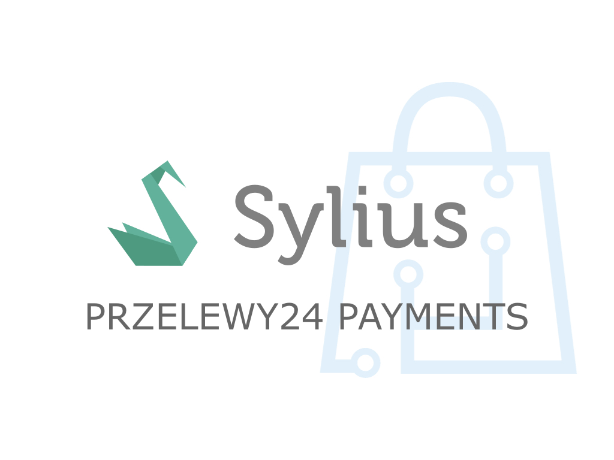

<h1 align="center">
    <a href="http://bitbag.shop" target="_blank">
        
    </a>
    <br />
    <a href="https://packagist.org/packages/bitbag/przelewy24-plugin" title="License" target="_blank">
        
    </a>
    <a href="https://packagist.org/packages/bitbag/przelewy24-plugin" title="Version" target="_blank">
        
    </a>
    <a href="http://travis-ci.org/BitBagCommerce/SyliusPrzelewy24Plugin" title="Build status" target="_blank">
            
        </a>
    <a href="https://scrutinizer-ci.com/g/BitBagCommerce/SyliusPrzelewy24Plugin/" title="Scrutinizer" target="_blank">
        
    </a>
    <a href="https://packagist.org/packages/bitbag/przelewy24-plugin" title="Total Downloads" target="_blank">
        
    </a>
    <p>
        
    </p>
</h1>

## Overview

This plugin allows you to integrate Przelewy24 payment with Sylius platform app. It includes all Sylius and Przelewy24 payment features.

## Support

You can order our support on [this page](https://bitbag.shop/products/sylius-mailchimp).

We work on amazing eCommerce projects on top of Sylius and other great Symfony based solutions, like eZ Platform, Akeneo or Pimcore.
Need some help or additional resources for a project? Write us an email on mikolaj.krol@bitbag.pl or visit
[our website](https://bitbag.shop/)! :rocket:

## Demo

We created a demo app with some useful use-cases of the plugin! Visit [demo.bitbag.shop](https://demo.bitbag.shop) to take a look at it. 

```bash
$ composer require bitbag/przelewy24-plugin
```

Add plugin dependencies to your `config/bundles.php` file:
```php
return [
    ...

    BitBag\SyliusPrzelewy24Plugin\BitBagSyliusPrzelewy24Plugin::class => ['all' => true],
];
```

## Customization

### Available services you can [decorate](https://symfony.com/doc/current/service_container/service_decoration.html) and forms you can [extend](http://symfony.com/doc/current/form/create_form_type_extension.html)

Run the below command to see what Symfony services are shared with this plugin:
```bash
$ bin/console debug:container bitbag_sylius_przelewy24_plugin
```

## Recurring subscription

### State Machine

For a better integration with Przelewy24’s recurring subscription, [you can use state machine callback.](http://docs.sylius.com/en/1.1/customization/state_machine.html#how-to-add-a-new-callback)

Available states:

- Processing: Subscription created but not active yet (startdate higher than “now”)
- Active: Subscription is in progress. Not all payments are done, but we wait until the next payment date
- Cancelled: The merchant cancelled the subscription
- Suspended: Mandates became invalid, so the subscription is suspended
- Completed: All subscription payments are executed according to the timetable

## Testing
```bash
$ composer install
$ cd tests/Application
$ yarn install
$ yarn run gulp
$ bin/console assets:install -e test
$ bin/console doctrine:database:create -e test
$ bin/console doctrine:schema:create -e test
$ bin/console server:run 127.0.0.1:8080 -e test
$ open http://localhost:8080
$ bin/behat
$ bin/phpspec run
```

## Contribution

Learn more about our contribution workflow on http://docs.sylius.org/en/latest/contributing/.
